LibraNest - Digital Library Management System

LibraNest is a web-based Digital Library Management System developed for
the OIBSIP Java Development Internship (Task 5).

Features

User

Register and login

Browse books

Search by title or author

Filter by category

View total and available copies

Issue available books

Return books

Automatic overdue fine calculation

View My Books and borrowing history

Reserve unavailable books

View My Reservations

Submit library queries through Contact Library

Logout

Admin

Admin login and role-based access

Dashboard

Add, edit and delete books

Manage book quantities

View issued books and due dates

Manage members

View fines and mark fines as paid

View contact messages

Mark messages as resolved

Fine Management

Overdue fines are calculated automatically at ₹5 per overdue day.

Advance Reservations

If a book has no available copies, a user can place an advance
reservation and track it from My Reservations.

Technology Stack

Java 17

Spring Boot

Spring MVC

Thymeleaf

Spring Data JPA / Hibernate

SQLite

HTML5 / CSS3

Maven

IntelliJ IDEA

Project Structure

DigitalLibraryManagementSystem/
├── pom.xml
├── README.md
├── database/
│   └── library.db
├── screenshots/
└── src/
└── main/
├── java/com/oibsip/library/
│   ├── config/
│   ├── controller/
│   ├── model/
│   ├── repository/
│   └── service/
└── resources/
├── static/css/
├── templates/
└── application.properties

Main Modules

Authentication: Registration, login, logout and role-based access.

Book Management: Admin CRUD operations for books, authors, ISBN,
categories and quantities.

Issue & Return: Users can issue available books and return them,
with availability updated in the database.

Fine Management: Automatic calculation of overdue fines at ₹5/day.

Reservations: Users can reserve books that are currently
unavailable.

Contact Management: Users submit queries and admins can view and
resolve them.

User Flow

Register / Login
↓
User Dashboard
↓
Browse Books
↓
Search / Filter
↓
Issue Book
↓
My Books
↓
Return Book

Unavailable-book flow:

Browse Books
↓
Book Unavailable
↓
Reserve Book
↓
My Reservations

Admin Flow

Admin Login
↓
Admin Dashboard
├── Manage Books
├── Issued Books
├── Manage Members
├── Manage Fines
└── Contact Messages

Database

LibraNest uses SQLite, so no separate database server is required.

Main tables:

users

books

issues

reservations

fines

contact_messages

Running the Project

Prerequisites

Java 17 or later

IntelliJ IDEA

Maven

Steps

Clone the repository.

Open JavaDevelopment-Task5-DigitalLibraryManagementSystem in
IntelliJ IDEA.

Let Maven download the dependencies.

Check the SQLite path in application.properties.

Run DigitalLibraryManagementSystemApplication.

Open http://localhost:8080 in a browser.

Project Highlights

Separate Admin and User roles

Persistent SQLite database

Book catalogue and CRUD management

Issue and return workflow

Automatic overdue fines

Advance reservations

Member management

Contact/query management

Polished responsive UI

Layered Controller / Service / Repository architecture

OIBSIP Internship

Organization: Oasis Infobyte
Internship: Java Development Internship
Task: Task 5 - Digital Library Management System

Author

Vinayak Pandey
B.Tech - Computer Science & Engineering (AI & ML)

License

Educational and internship project.

## Screenshots

### User Interface

#### Login
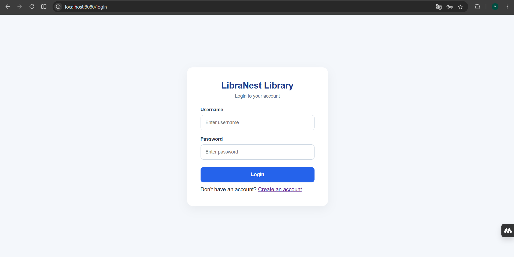

#### User Dashboard
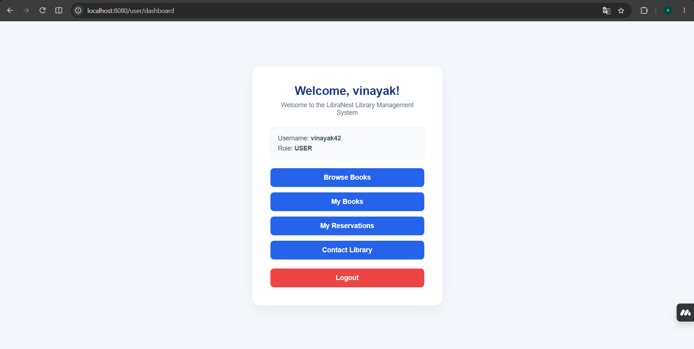

#### Browse Books
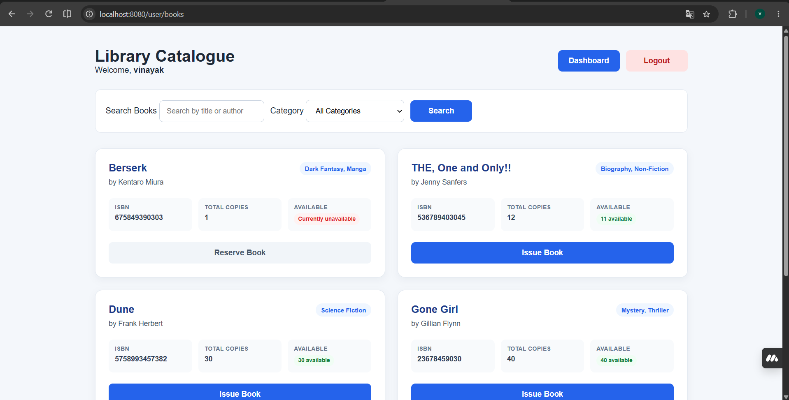

#### My Books
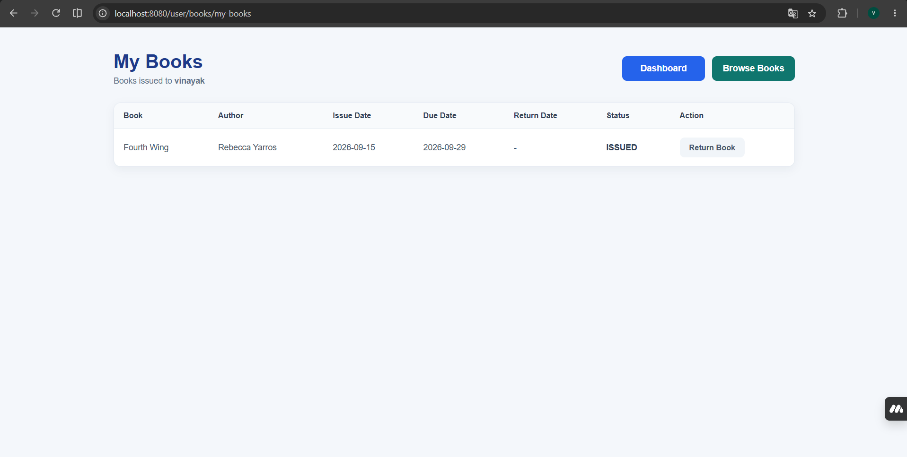

#### My Reservations
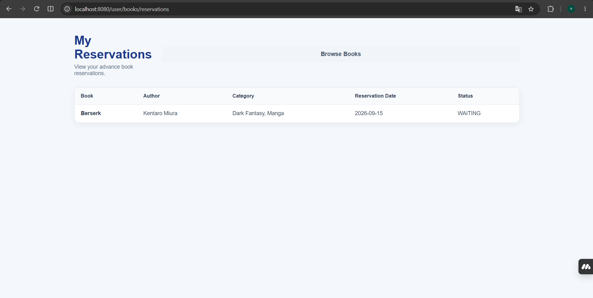

#### Contact Library
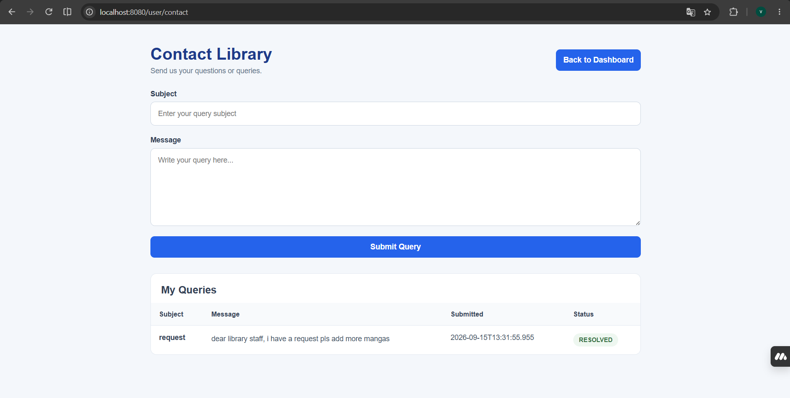

### Admin Interface

#### Admin Dashboard
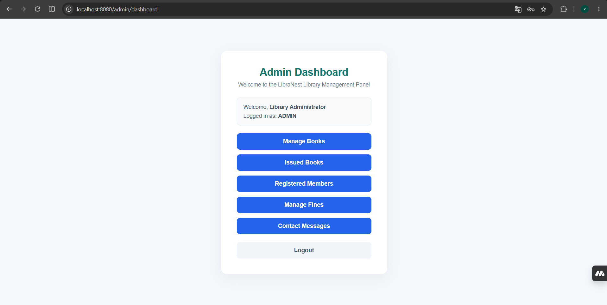

#### Manage Books
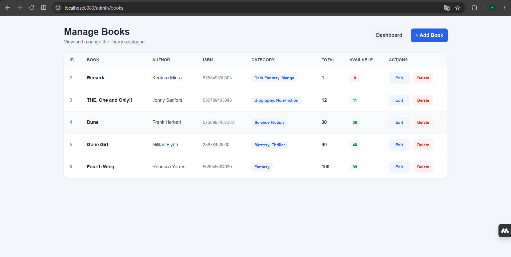

#### Add / Edit Book
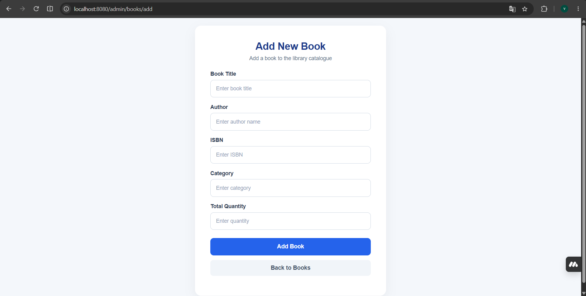

#### Issued Books
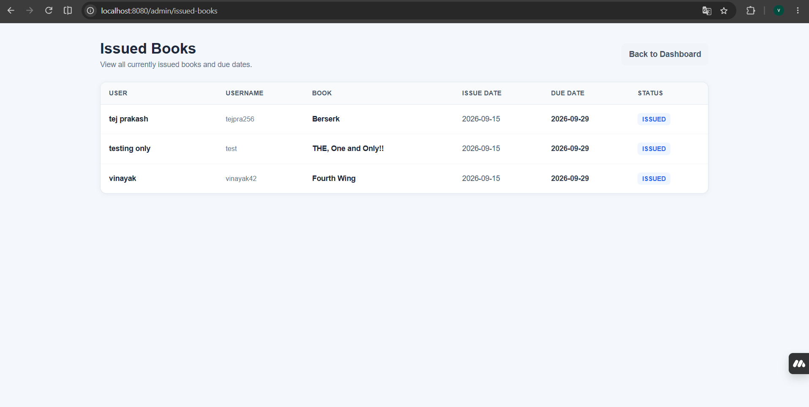

#### Fines
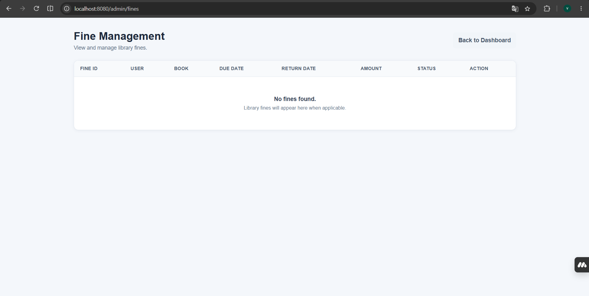

#### Contact Messages
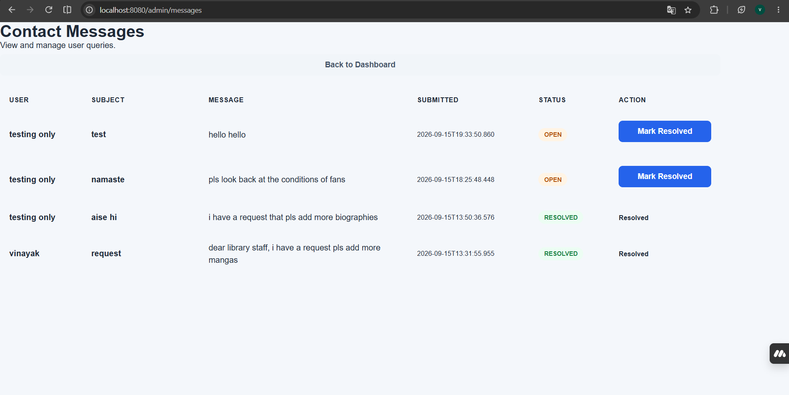